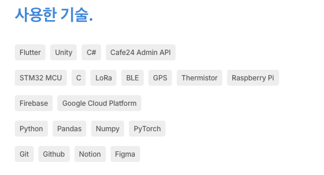
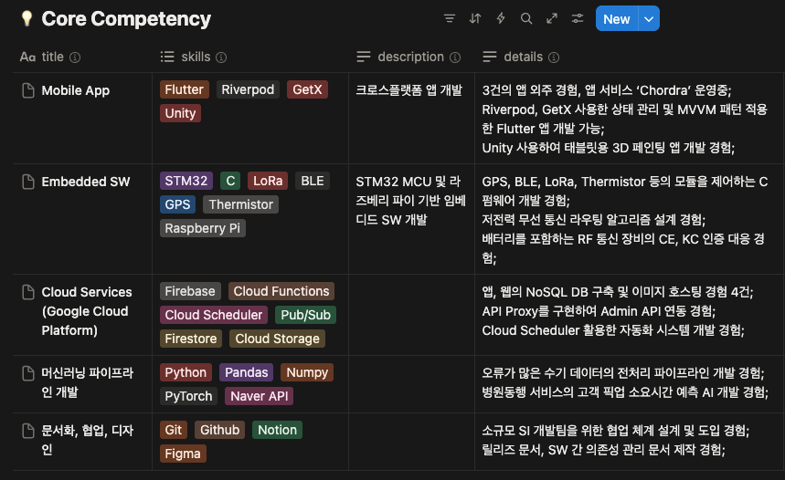
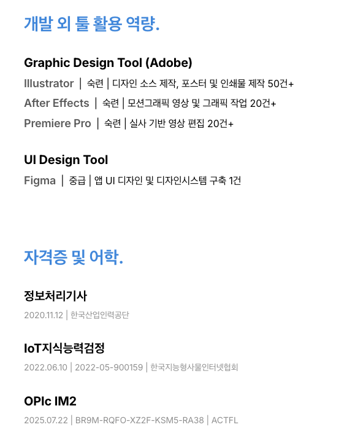

# Notion DB 연동 개발자 이력서 사이트

React와 Next.js로 구축된 공개 이력서 사이트입니다. Notioin Database API를 연동하여 Notion 데이터베이스를 수정하면 이력서 페이지에 반영되도록 구현했습니다.

이재익 이력서 페이지: https://jaeikleedev.github.io/jaeiklee-resume/
<br>
이재익 이력서 Notion 데이터베이스: https://fluorescent-airplane-153.notion.site/Jaeik-Lee-Resume-Database-278b61feddfe80628aadf4982bcb492a

## ✨ 주요 기능

- 🔄 **Notion API 연동**: Notion에서 이력서 내용을 수정하면 페이지에 반영
- 📱 **반응형 디자인**: 모바일과 데스크톱 최적화
- 👨‍💻 **개발자 최적화**: GitHub 링크 기술, 프로젝트, 포트폴리오 등 개발자 이력 최적화 구성
- 👁️ **show/hide**: 각 항목을 show/hide 할 수 있는 기능
- 🛠️ **Tech chip**: 기술스택을 chip UI로 표현

## 🛠 기술 스택

- **Frontend**: Next.js 15, React 19, TypeScript
- **Styling**: Tailwind CSS, Custom CSS Variables
- **Fonts**: Inter (주요 폰트), JetBrains Mono (코드/기술 스택)
- **API Integration**: Notion API (@notionhq/client)

## 📋 이력서 섹션 구성

1. **개인 정보**: (연락처, 사진, 소개, ...)
2. **사용한 기술**:
3. **핵심 역량**
4. **업무 경험**
5. **프로젝트 경험**
6. **포트폴리오** (개인 프로젝트)
7. **가치관**
8. **개발 외 툴 활용 역량**
9. **학력**
10. **자격증 및 어학**
11. **병역**

## 📁 프로젝트 구조

```
src/
├── app/                     # Next.js App Router
│   ├── globals.css         # 글로벌 스타일 및 디자인 시스템
│   ├── layout.tsx          # 루트 레이아웃
│   ├── page.tsx            # 메인 이력서 페이지 (Notion API 연동)
│   └── api/                # API 라우트
│       └── resume/         # 이력서 데이터 API
├── components/              # React 컴포넌트
│   ├── layout/             # 레이아웃 컴포넌트
│   │   ├── Page.tsx        # A4 페이지 래퍼
│   │   └── ResumeLayout.tsx # 이력서 전체 레이아웃
│   ├── sections/           # 이력서 섹션별 컴포넌트
│   │   ├── CertificationSection.tsx # 자격증 및 어학 섹션
│   │   ├── ContactInfo.tsx # 연락처 정보 섹션 (프로필 사진 포함)
│   │   ├── CoreCompetencySection.tsx # 핵심 역량 섹션
│   │   ├── EducationSection.tsx # 학력 섹션
│   │   ├── MilitaryServiceSection.tsx # 병역 섹션
│   │   ├── OtherToolSection.tsx # 개발 외 툴 섹션
│   │   ├── ProjectItem.tsx # 프로젝트/포트폴리오 아이템 (공통 컴포넌트)
│   │   ├── SkillSection.tsx # 기술 스택 섹션
│   │   ├── ValueSection.tsx # 가치관 섹션
│   │   └── WorkAchievementSection.tsx # 업무 성과 섹션 (소제목별)
│   └── ui/                 # 재사용 가능한 UI 컴포넌트
│       └── TechChips.tsx   # 기술 스택 칩
├── lib/                    # 유틸리티 함수
│   └── notion.ts          # Notion API 클라이언트 및 데이터 fetching
└── types/                 # TypeScript 타입 정의
    └── index.ts           # 공통 타입 정의
```

## 🎨 디자인 시스템

### 타이포그래피 위계
- **Hero** (40px, 700): 메인 제목
- **Section Title** (28px, 700): 섹션 제목  
- **Subsection Title** (22px, 600): 서브섹션 제목
- **Item Title** (20px, 700): 아이템 제목
- **Item Subtitle** (18px, 600): 아이템 서브제목
- **Body** (16px, 400): 본문 텍스트
- **Meta** (14px, 400): 메타 정보

### Spacing 시스템
- `--space-xs`: 8px
- `--space-sm`: 16px  
- `--space-md`: 24px
- `--space-lg`: 32px
- `--space-xl`: 48px
- `--space-2xl`: 64px
- `--space-3xl`: 96px

## 📋 Notion DB 구성

#### Personal Info 데이터베이스
- **name** (Title) - 이름
- **position** (Rich Text) - 직책/포지션
- **email** (Email) - 이메일
- **phone** (Phone Number) - 전화번호
- **location** (Rich Text) - 위치
- **photo** (Files & media) - 프로필 사진
- **introduction** (Rich Text) - 짧은 소개
- **github** (URL) - 깃허브
- **linkedin** (URL) - 링크드인
- **website** (URL) - 웹사이트

#### Skill 데이터베이스
- **title** (Title) - 카테고리
- **skills** (Multi-select) - 기술 스택
- **order** (Number) - 정렬 순서 (1이 맨 위로)
- **show** (Select) - 표시 여부

#### Core Competency 데이터베이스
- **title** (Title) - 제목
- **description** (Rich Text) - 설명
- **skills** (Multi-select) - 관련 기술 스택
- **details** (Rich Text) - 사례, bullet point 설명
- **order** (Number)
- **show** (Select)

#### Work Summary 데이터베이스
- **company** (Title) - 회사
- **position** (Rich Text) - 직책
- **period** (Rich Text) - 근무 기간
- **description** (Rich Text) - 회사 설명
- **order** (Number)
- **show** (Select)

#### Work Achievement 데이터베이스
- **title** (Title) - 성과 소제목
- **details** (Rich Text) - 성과 디테일
- **skills** (Multi-select) - 해당 성과 관련 기술 스택
- **order** (Number)
- **show** (Select)

#### Project 데이터베이스
- **title** (Title) - 프로젝트 제목
- **description** (Rich Text) - 프로젝트 설명
- **period** (Rich Text) - 개발 기간
- **skills** (Multi-select) - 사용한 기술 스택
- **details** (Rich Text) - 성과 상세
- **contribution** (Rich Text) - 기여도 정보
- **github** (URL) - GitHub 저장소 링크
- **website** (URL) - 웹사이트 링크
- **ios** (URL) - iOS 앱스토어 링크
- **android** (URL) - Android 플레이스토어 링크
- **post** (URL) - 블로그 글 링크
- **order** (Number)
- **show** (Select)

#### Portfolio 데이터베이스
- **title** (Title) - 포트폴리오 제목
- **description** (Rich Text) - 포트폴리오 설명
- **period** (Rich Text) - 개발 기간
- **skills** (Multi-select) - 사용한 기술 스택
- **details** (Rich Text) - 주요 기능들
- **github** (URL) - GitHub 저장소 링크
- **website** (URL) - 웹사이트 링크
- **ios** (URL) - iOS 앱스토어 링크
- **android** (URL) - Android 플레이스토어 링크
- **post** (URL) - 블로그 글 링크
- **contribution** (Rich Text) - 기여도 정보
- **order** (Number)
- **show** (Select)

#### Value 데이터베이스
- **title** (Title) - 가치관 제목
- **details** (Rich Text) - 상세 내용
- **order** (Number)
- **show** (Select)

#### Other Tool 데이터베이스
- **title** (Select) - 도구명
- **category** (Title) - 카테고리
- **description** (Rich Text) - 숙련도 및 경험 설명
- **order** (Number)
- **show** (Select)

#### Education 데이터베이스
- **title** (Title) - 학교명
- **degree** (Rich Text) - 학위/전공
- **period** (Rich Text) - 학력 기간
- **location** (Rich Text) - 위치
- **order** (Number)
- **show** (Select)

#### Certification 데이터베이스
- **title** (Title) - 자격증명
- **date** (Rich Text) - 취득일
- **number** (Rich Text) - 자격증 번호
- **issuer** (Rich Text) - 발행기관
- **order** (Number)
- **show** (Select)

#### Military Service 데이터베이스
- **title** (Rich Text) - 병역 정보
- **period** (Rich Text) - 복무기간

## 🚀 템플릿 사용하기

### 사용 방법

- **클론** 본 리포지토리를 로컬 환경에 클론
- **의존성 설치**: `npm install`
- **이력서 페이지**: `http://localhost:3000`
- **개발 서버**: `npm run dev`로 로컬 개발 서버 실행
- **빌드**: `npm run build`로 정적 사이트 생성

### 1. Notion Integration 생성

1. [Notion Developers](https://www.notion.so/my-integrations)에서 새 Integration 생성
   - Integration 이름 설정 (예: "Resume API")
   - Associated workspace: 본인 workspace
   - Type: Internal
2. Internal Integration Secret 복사해두기 - Notion 연동에 사용

### 2. Notion 데이터베이스 생성

[이재익 이력서 Notion Database](https://fluorescent-airplane-153.notion.site/Jaeik-Lee-Resume-Database-278b61feddfe80628aadf4982bcb492a)를 Duplicate 합니다.


> duplicate as template 실패하는 경우가 많습니다. 다양한 브라우저, 시크릿 모드, 모바일에서 캐시 삭제 후 시도해보시길 바랍니다. <br> 그래도 안 되는 경우, [이재익 이력서 Notion Database](https://fluorescent-airplane-153.notion.site/Jaeik-Lee-Resume-Database-278b61feddfe80628aadf4982bcb492a)와 위의 'Notion DB 구성' 참고해서 직접 구성해주시면 됩니다. **각 property 이름은 소문자**로 해주세요. **notion.ts의 interface와 정확히 동일**해야 합니다.

### 3. 환경 변수 설정

클론한 리포지토리의 루트에 `.env.local` 파일을 생성하고 다음 환경변수들을 설정:

```env
# Notion API 설정
NOTION_TOKEN=your_notion_integration_token_here

# Notion Database IDs (각 데이터베이스 URL에서 32자리 ID 추출)
NOTION_CERTIFICATION_DB_ID=your_certification_database_id_here
NOTION_CORE_COMPETENCY_DB_ID=your_core_competency_database_id_here
NOTION_EDUCATION_DB_ID=your_education_database_id_here
NOTION_MILITARY_SERVICE_DB_ID=your_military_service_database_id_here
NOTION_OTHER_TOOL_DB_ID=your_other_tool_database_id_here
NOTION_PERSONAL_INFO_DB_ID=your_personal_info_database_id_here
NOTION_PORTFOLIO_DB_ID=your_portfolio_database_id_here
NOTION_PROJECT_DB_ID=your_project_database_id_here
NOTION_SKILL_DB_ID=your_skill_database_id_here
NOTION_VALUE_DB_ID=your_value_database_id_here
NOTION_WORK_ACHIEVEMENT_DB_ID=your_work_achievement_database_id_here
NOTION_WORK_SUMMARY_DB_ID=your_work_summary_database_id_here
```

각 ID는 다음과 같이 복사해옵니다.

#### NOTION_TOKEN

위의 '1. Notion Integration 생성 > 2.' 에서 복사한 Internal Integration Secret 입니다.

#### Notion Database IDs

각 데이터베이스의 세팅 > 'Manage data sources'


점 세개 메뉴 > 'Copy data source ID'


### 4. 정렬 시스템

Notion Database API는 순서를 보장하지 않습니다. 모든 데이터베이스(Personal Info, Military Service 제외)에서 **order** 프로퍼티를 사용하여 표시 순서를 제어합니다:

- **order 1** → 맨 위에 표시
- **order 2** → 두 번째에 표시
- **order 3** → 세 번째에 표시
- **order 값이 없거나 잘못된 경우** → 맨 아래에 표시

**정렬 예시:**

Skill 데이터베이스:


웹사이트 화면



### 5. 데이터 입력 방법 및 파싱 규칙

#### 📝 텍스트 구분자 규칙
이 템플릿에서는 **세미콜론(;)**을 구분자로 사용합니다:

- **Rich Text 필드**: 세미콜론(;)으로 구분하여 여러 항목 입력
- **Multi-select 필드**: 각 항목을 개별 옵션으로 선택

예시:

핵심 역량 데이터베이스



웹사이트 화면 핵심 역량 섹션


### 6. 사용하지 않는 섹션(DB)/프로퍼티

내용이 없는 데이터베이스/프로퍼티는 페이지에 표시하지 않도록 설계

#### 예시: 

데이터베이스: 학력 DB 내용 X, 정보처리기사 'number' 프로퍼티 없음


페이지 결과: 학력 섹션 표시 안 됨. 정보처리기사 자격번호 표시하지 않음



