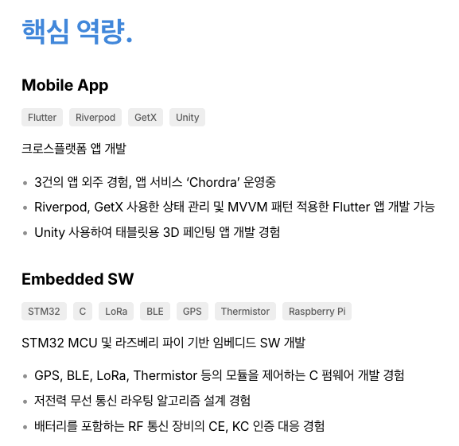
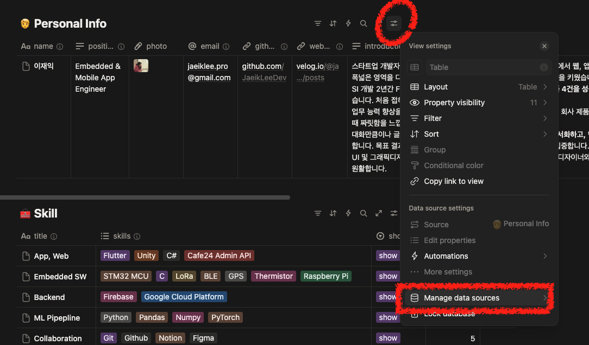
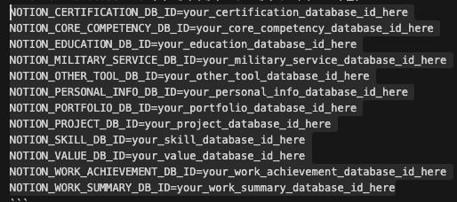
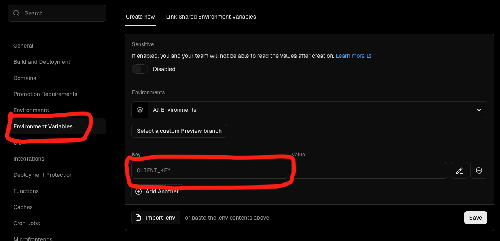

# Notion DB 연동 개발자 이력서 사이트

React와 Next.js로 구축된 공개 이력서 사이트입 템플릿입니다. 연동된 Notion 데이터베이스를 수정하면 이력서 페이지에 반영되도록 구현했습니다.

### Notion DB 및 이력서 사이트 예시

- [이재익 이력서 페이지](https://jaeikleedev.github.io/resume/)
- [이재익 이력서 Notion 데이터베이스](https://fluorescent-airplane-153.notion.site/Jaeik-Lee-Resume-Database-278b61feddfe80628aadf4982bcb492a)

## ✨ 주요 기능

- 🔄 **Notion API 연동**: Notion에서 이력서 내용을 수정하면 페이지에 반영
- 📱 **반응형 디자인**: 모바일과 데스크톱 최적화
- 👨‍💻 **개발자 최적화**: 기술 스택, 포트폴리오 등 개발자 이력에 최적화된 구성
- 👁️ **show/hide**: 원하는 섹션/프로퍼티만 show/hide 할 수 있는 기능
- 📄 **PDF 다운로드**: 이력서를 PDF로 다운로드 가능

## 🛠 기술 스택

- **Frontend**: Next.js 15, React 19, TypeScript
- **Styling**: Tailwind CSS, Custom CSS Variables
- **Fonts**: Pretendard (주요 폰트), JetBrains Mono (코드/기술 스택)
- **API Integration**: Notion API (@notionhq/client)
- **PDF Generation**: Puppeteer + @sparticuz/chromium
- **Deployment**: Vercel

## 📋 이력서 섹션 구성

1. 개인 정보
2. 사용한 기술
3. 핵심 역량
4. 업무 경험
5. 프로젝트 경험
6. 포트폴리오
7. 가치관
8. 개발 외 툴 활용 역량
9. 학력
10. 자격증 및 어학
11. 병역

<br>

---

<br>

## 📋 Notion DB 구성하기

### DB별 필드

각 필드(Notion의 property)를 '프로퍼티명 (프로퍼티 타입)'으로 표시.

> [!NOTE] 프로퍼티 타입 종류 (Notion 앱에서 설정하는 방법)
> - **Title**: 데이터베이스 생성 시 기본으로 제공되는 "Name" 필드 (이름 변경 가능)
> - **Rich Text**: 프로퍼티 추가 → "Text" 선택 (앱에서는 "Text"로 표시)
> - **Multi-select**: 프로퍼티 추가 → "Multi-select" 선택 → 옵션 추가
> - **Select**: 프로퍼티 추가 → "Select" 선택 → 옵션 추가
> - **Number**: 프로퍼티 추가 → "Number" 선택
> - **URL**: 프로퍼티 추가 → "URL" 선택
> - **Email**: 프로퍼티 추가 → "Email" 선택
> - **Phone**: 프로퍼티 추가 → "Phone" 선택
> - **Files & media**: 프로퍼티 추가 → "Files & media" 선택 

#### Personal Info 데이터베이스
- **name** (Title) - 이름
- **position** (Rich Text) - 직책/포지션
- **email** (Email) - 이메일
- **phone** (Phone Number) - 전화번호
- **location** (Rich Text) - 위치
- **photo** (Files & media) - 프로필 사진
- **introduction** (Rich Text) - 짧은 소개
- **github** (URL) - 깃허브
- **linkedin** (URL) - 링크드인
- **website** (URL) - 웹사이트

#### Skill 데이터베이스
- **title** (Title) - 카테고리 분류를 위한 필드. 화면에는 나타나지 않음.
- **skills** (Multi-select) - 기술 스택
- **order** (Number) - 정렬 순서 (1이 맨 위로)
- **show** (Select) - 표시 여부

#### Core Competency 데이터베이스
- **title** (Title) - 제목
- **description** (Rich Text) - 설명
- **skills** (Multi-select) - 관련 기술 스택
- **details** (Rich Text) - 사례, bullet point 설명
- **order** (Number)
- **show** (Select)

#### Work Summary 데이터베이스
- **company** (Title) - 회사
- **position** (Rich Text) - 직책
- **period** (Rich Text) - 근무 기간
- **description** (Rich Text) - 회사 설명
- **order** (Number)
- **show** (Select)

#### Work Achievement 데이터베이스
- **title** (Title) - 성과 소제목
- **details** (Rich Text) - 성과 디테일
- **skills** (Multi-select) - 해당 성과 관련 기술 스택
- **company** (Rich Text) - Work Summary DB > 'company'와 같은 값
- **order** (Number)
- **show** (Select)

#### Project 데이터베이스
- **title** (Title) - 프로젝트 제목
- **description** (Rich Text) - 프로젝트 설명
- **period** (Rich Text) - 개발 기간
- **skills** (Multi-select) - 사용한 기술 스택
- **details** (Rich Text) - 성과 상세
- **contribution** (Rich Text) - 기여도 정보
- **github** (URL) - GitHub 저장소 링크
- **website** (URL) - 웹사이트 링크
- **ios** (URL) - iOS 앱스토어 링크
- **android** (URL) - Android 플레이스토어 링크
- **post** (URL) - 블로그 글 링크
- **order** (Number)
- **show** (Select)

#### Portfolio 데이터베이스
- **title** (Title) - 포트폴리오 제목
- **description** (Rich Text) - 포트폴리오 설명
- **period** (Rich Text) - 개발 기간
- **skills** (Multi-select) - 사용한 기술 스택
- **details** (Rich Text) - 주요 기능들
- **github** (URL) - GitHub 저장소 링크
- **website** (URL) - 웹사이트 링크
- **ios** (URL) - iOS 앱스토어 링크
- **android** (URL) - Android 플레이스토어 링크
- **post** (URL) - 블로그 글 링크
- **contribution** (Rich Text) - 기여도 정보
- **order** (Number)
- **show** (Select)

#### Value 데이터베이스
- **title** (Title) - 가치관 제목
- **details** (Rich Text) - 상세 내용
- **order** (Number)
- **show** (Select)

#### Other Tool 데이터베이스
- **title** (Title) - 도구명
- **category** (Select) - 카테고리
- **description** (Rich Text) - 숙련도 및 경험 설명
- **order** (Number)
- **show** (Select)

#### Education 데이터베이스
- **title** (Title) - 학교명
- **degree** (Rich Text) - 학위/전공
- **period** (Rich Text) - 학력 기간
- **location** (Rich Text) - 위치
- **order** (Number)
- **show** (Select)

#### Certification 데이터베이스
- **title** (Title) - 자격증명
- **date** (Rich Text) - 취득일
- **number** (Rich Text) - 자격증 번호
- **issuer** (Rich Text) - 발행기관
- **order** (Number)
- **show** (Select)

#### Military Service 데이터베이스
- **title** (Title) - 병역 정보
- **period** (Rich Text) - 복무기간

### 1. Notion Integration 생성하기

1. [Notion Developers](https://www.notion.so/my-integrations)에서 새 Integration 생성
   - Integration 이름 설정 (예: "Resume API")
   - Associated workspace: 본인 workspace
   - Type: Internal
2. Internal Integration Secret 복사해두기 - Notion 연동에 사용

### 2. Notion 데이터베이스 생성하기

[이재익 이력서 Notion Database](https://fluorescent-airplane-153.notion.site/Jaeik-Lee-Resume-Database-278b61feddfe80628aadf4982bcb492a)를 Duplicate 합니다.


duplicate as template 실패하는 경우가 많습니다. 다양한 브라우저, 시크릿 모드, 모바일에서 캐시 삭제 후 시도해보시길 바랍니다.

그래도 안 되는 경우, [이재익 이력서 Notion Database](https://fluorescent-airplane-153.notion.site/Jaeik-Lee-Resume-Database-278b61feddfe80628aadf4982bcb492a)와 위의 'Notion DB 구성' 참고해서 직접 구성해주시면 됩니다. 

> [!IMPORTANT]
> **각 property 이름은 소문자**로 해주세요. **notion.ts의 interface와 정확히 동일**해야 합니다.

### 3. Rich Text, Multi-select 필드의 데이터 입력 및 파싱 규칙

- **[Rich Text]** Bullet point: 줄 맨 앞에 '- ' (대시 + 공백) 입력
- **[Rich Text]** 줄바꿈: Notion에서 입력한 그대로 줄바꿈이 유지되어 표시
- **[Multi-select]** 각 항목을 개별 옵션으로 인식

#### 예시: skills 필드는 Multi-select, details필드는 Rich Text

**Notion DB 예시:**


**이력서 결과 페이지:**



### 4. 업무 경험 성과 나열하기

**여러 회사에서 근무한 경험이 있고, 각 회사별로 여러 성과를 보여주고 싶다면** 이렇게 구성하세요:

#### 회사별 기본 정보 입력 (Work Summary DB)
- 각 회사마다 하나의 레코드 생성
- 회사명, 직책, 근무기간, 회사 설명 등 입력

#### 성과별 상세 정보 입력 (Work Achievement DB)
- 각 성과마다 개별 레코드 생성
- **`company` 필드에 해당 성과가 속하는 회사명 입력(Work Summary DB의 `company` 필드와 동일)**

#### 예시

DB 구성


이력서 페이지


### 5. 사용하지 않는 섹션(DB)/프로퍼티

내용이 없는 데이터베이스/프로퍼티는 페이지에 표시하지 않도록 설계

#### 예시:

데이터베이스: 학력 DB 내용 X, 정보처리기사 'number' 프로퍼티 없음


페이지 결과: 학력 섹션 표시 안 됨. 정보처리기사 자격번호 표시하지 않음


### 6. DB의 각 row를 원하는 순서로 정렬하기

Notion Database API는 순서를 보장하지 않습니다. 모든 데이터베이스(Personal Info, Military Service 제외)에서 **order** 프로퍼티를 사용하여 표시 순서를 제어합니다:

- **order 1** → 맨 위에 표시
- **order 2** → 두 번째에 표시
- **order 3** → 세 번째에 표시
- **order 값이 없거나 잘못된 경우** → 맨 아래에 표시

**정렬 예시:**

Skill 데이터베이스:


웹사이트 화면


## 🚀 템플릿 사용하기

### 사용 방법

- **Fork** 본 리포지토리를 fork (또는 클론) 후 깃헙 리포지토리에 푸시
- **의존성 설치**: `npm install`
- 클론한 리포지토리의 루트에 `.env.local` 파일을 생성하고 다음 환경변수들을 설정:
```env
# Notion API 설정
NOTION_TOKEN=your_notion_integration_token_here

# Notion Database IDs (각 데이터베이스 URL에서 32자리 ID 추출)
NOTION_CERTIFICATION_DB_ID=your_certification_database_id_here
NOTION_CORE_COMPETENCY_DB_ID=your_core_competency_database_id_here
NOTION_EDUCATION_DB_ID=your_education_database_id_here
NOTION_MILITARY_SERVICE_DB_ID=your_military_service_database_id_here
NOTION_OTHER_TOOL_DB_ID=your_other_tool_database_id_here
NOTION_PERSONAL_INFO_DB_ID=your_personal_info_database_id_here
NOTION_PORTFOLIO_DB_ID=your_portfolio_database_id_here
NOTION_PROJECT_DB_ID=your_project_database_id_here
NOTION_SKILL_DB_ID=your_skill_database_id_here
NOTION_VALUE_DB_ID=your_value_database_id_here
NOTION_WORK_ACHIEVEMENT_DB_ID=your_work_achievement_database_id_here
NOTION_WORK_SUMMARY_DB_ID=your_work_summary_database_id_here
```
각 ID는 다음과 같이 복사해옵니다.

#### NOTION_TOKEN

위의 '1. Notion Integration 생성 > 2.' 에서 복사한 Internal Integration Secret 입니다.

#### Notion Database IDs

각 데이터베이스의 세팅 > 'Manage data sources'



점 세개 메뉴 > 'Copy data source ID'


- **개발 서버**: `npm run dev`로 로컬 개발 서버 실행
- **이력서 페이지**: `http://localhost:3000`
- **빌드**: `npm run build`로 정적 사이트 생성

## 🌐 Vercel 배포 가이드

### Vercel 배포 특징

- 🔄 **실시간 반영**: Notion에서 수정하면 웹사이트 새로고침만으로 즉시 반영
- 🚀 **자동 배포**: GitHub push 시 자동으로 배포 (2-3분 소요)
- 💰 **무료 사용**: 무료 플랜(월 4시간 CPU, 360GB-시간 메모리)으로 충분
- 🌍 **빠른 속도**: 글로벌 CDN으로 전 세계 어디서나 빠른 로딩

### 1. Vercel 프로젝트 생성

1. [Vercel](https://vercel.com)에 접속하여 계정 생성
2. Add New Project
3. Continue with Github
4. Import Git Repository > Install > 내 계정 선택
5. Only select repositories > fork/클론한 리포지토리 선택
6. Import

### 3. 환경 변수 설정

'Environment Variables'를 열어 로컬의 .env.local 과 동일한 환경변수를 등록합니다. 또는 Deploy 후 Vercel 프로젝트 설정에서 **"Environment Variables"** 섹션에서도 추가할 수 있습니다.

> [!TIP]
> variable을 한번에 추가할 수 있습니다.
> 1. 아래와 같이 추가할 ID 전체를 선택, Copy합니다.
> 2. 'Key' 부분에 커서를 놓고 Paste합니다.





### 4. 배포 설정

1. **Framework Preset**: Next.js (자동 감지)
2. **Root Directory**: `./` (기본값)
3. **Build Command**: `npm run build` (기본값)
4. **Output Directory**: `.next` (기본값)

### 5. 배포 실행

1. **"Deploy"** 버튼 클릭
2. 배포 완료까지 2-3분 대기
3. 제공된 URL로 접속하여 확인

### 6. PDF 생성 기능을 위한 Vercel 설정

PDF 다운로드 기능이 정상 작동하려면 Vercel 설정을 조정해야 합니다:

1. **Vercel 대시보드** → 프로젝트 선택
2. **Settings** → **Deployment Protection**
3. **Vercel Authentication**: **Disabled**

> PDF 생성 시 Vercel 로그인 화면이 나타나는 문제를 해결하기 위해 필요합니다.
> 이력서 사이트는 공개 정보이므로 보안상 문제없습니다.

### 7. 업데이트 방식

#### **코드 변경 시 (자동 배포)**
- **GitHub Push**: 코드 수정 후 `git push` → Vercel 자동 배포

#### **Notion 데이터 변경 시 (수동 배포)**
1. **Notion에서 이력서 내용 수정**
2. **Vercel Dashboard** → 프로젝트 선택
3. **"Redeploy" 버튼 클릭**
4. **2-3분 후 완료** → 웹사이트에 반영


### 8. 커스텀 도메인 설정 (선택사항)

1. Vercel 프로젝트 설정에서 **"Domains"** 섹션으로 이동
2. 원하는 도메인 입력
3. DNS 설정에 따라 도메인 연결

## 📄 PDF 생성 기능

### 특징
- **완전한 렌더링**: 웹페이지와 100% 동일한 PDF 생성
- **자동 동기화**: Notion 데이터 변경 시 PDF도 자동 반영
- **A4 최적화**: 인쇄에 최적화된 레이아웃
- **폰트 포함**: Pretendard 폰트가 PDF에 정확히 적용

### 기술 구현
- **Puppeteer**: 브라우저 자동화로 HTML을 PDF로 변환
- **@sparticuz/chromium**: Vercel 서버리스 환경에 최적화된 Chromium
- **실시간 렌더링**: Notion API → 웹페이지 → PDF 변환
